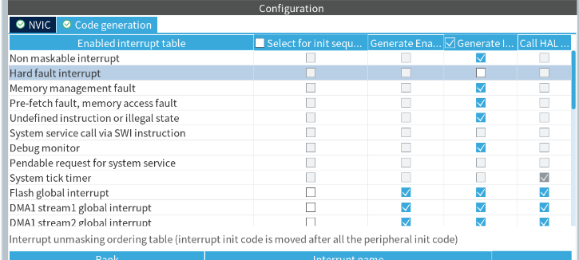

# CmBacktrace: ARM Cortex-M 系列 MCU 错误追踪库

## 多语言支持


| Language             | Location (or type)         | Language tag |
| -------------------- | -------------------------- | ------------ |
| English              | United States              | en-US        |
| Chinese (Simplified) | People's Republic of China | zh-CN        |

## 移植适配

hardfault 移植

由于cmbacktrace自己有hardfault处理所以在cubemx里关闭st自身的hardfault生成



.ld文件修改（gcc 需要下面四个 但是ld文件缺失俩需要手动补充）


```
._user_heap_stack :
  {
    . = ALIGN(8);
    PROVIDE ( end = . );
    PROVIDE ( _end = . );
    . = . + _Min_Heap_Size;
    _sstack = .; /*添加适配*/
    . = . + _Min_Stack_Size;
    . = ALIGN(8);
  } >RAM

 /* The program code and other data goes into FLASH */
  .text :
  {
    . = ALIGN(4);
    _stext = .;        /*添加适配*/
    *(.text)           /* .text sections (code) */
    *(.text*)          /* .text* sections (code) */
    *(.glue_7)         /* glue arm to thumb code */
    *(.glue_7t)        /* glue thumb to arm code */
    *(.eh_frame)

    KEEP (*(.init))
    KEEP (*(.fini))

    . = ALIGN(4);
    _etext = .;        /* define a global symbols at end of code */
  } >FLASH
```

2.修改freertos的task.c

增加变量

```c
在 typedef struct tskTaskControlBlock 里添加
UBaseType_t     uxSizeOfStack;      /*< Support For CmBacktrace >*/
在 prvInitialiseNewTask 函数里添加
pxNewTCB->uxSizeOfStack = ulStackDepth;   /*< Support For CmBacktrace >*/
```

```c
/*< Support For CmBacktrace >*/
uint32_t * vTaskStackAddr()
{
    return pxCurrentTCB->pxStack;
}

uint32_t vTaskStackSize()
{
    #if ( portSTACK_GROWTH > 0 )
  
    return (pxNewTCB->pxEndOfStack - pxNewTCB->pxStack + 1);
  
    #else /* ( portSTACK_GROWTH > 0 )*/
  
    return pxCurrentTCB->uxSizeOfStack;
  
    #endif /* ( portSTACK_GROWTH > 0 )*/
}

char * vTaskName()
{
    return pxCurrentTCB->pcTaskName;
}
/*-----------------------------------------------------------*/
```

3.修改FreeRTOS.h

```c
typedef struct xSTATIC_TCB中添加 
UBaseType_t     uxSizeOfStack;      /*< Support For CmBacktrace >*/
```

4. 修改.s启动文件

   ```
      /*  
      .weak      HardFault_Handler
      .thumb_set HardFault_Handler,Default_Handler
      */

       .extern   HardFault_Handler  /*使用外部hardfault 函数*/
   ```
